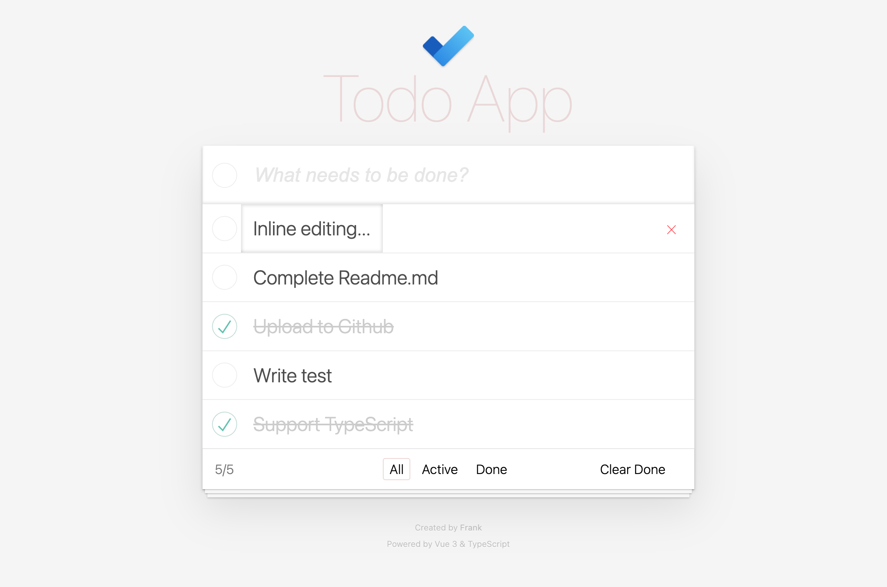

English | [简体中文](README.zh-CN.md)

<p align="center">
    
</p>

<p align="center">
  
</p>

# Todo App

Talk is cheap, show me the Demo

Live demo: [https://hefengxian.github.io/vue3-ts-vite-vitest-todo/](https://hefengxian.github.io/vue3-ts-vite-vitest-todo/)



## Why

Todo App is a typical start-up project, especially for some new frameworks. maybe you guys already know how to build one with some framework you are familiar with (even there is one on Vue docs). But when i decide to start learn & using Vue3, there is no practice demo ONLY use the following:

- Pure Composition API
- New Reactive API
- TypeScript
- Pure TS/TSX no SFC `*.vue`
- Vite for build tool
- Learn/Practice how to write tests (Vitest as the testing framework)

So i write one by myself, to practice new Vue3 new APIs, new build tools...

Hope it will helpful for those people like me, to experience new APIs and tools that bring to you

## Dev

> Here we use `yarn`

You need to know

- Conception of Vue3 Composition APIs/Reactive APIs/`setup()`
- TypeScript
- Vue Test Util (if you want write some test)
- Less (CSS build by Less)
- JSX syntax for Vue3 (quite difference to React.js JSX)

```bash
# install dependencies
yarn install

# dev mode with HMR
yarn dev

# run test
yarn test

# build
yarn build
```

## Recommended IDE Setup

- [VSCode](https://code.visualstudio.com/) + [Volar](https://marketplace.visualstudio.com/items?itemName=johnsoncodehk.volar)

## License

MIT
